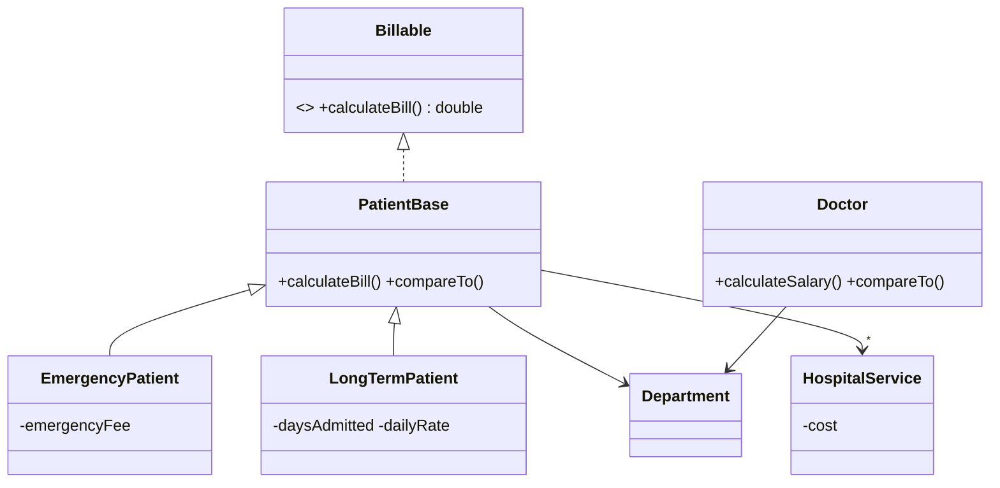

# Hospital Management System (Java OOP)


This is an object-oriented model of a hospital's patients, doctors, departments and billable services. It demonstrates **inheritance, abstraction, interfaces, polymorphism and `Comparable`-based sorting**.



- **Polymorphic billing:** each patient type overrides `calculateBill()`. Emergency patients pay a flat fee plus services, and long-term patients pay days × daily rate plus services, with tax applied in both cases.
- **Sorting:** doctors sort by computed salary (base × degree multiplier + overtime pay), and patients sort by bill amount. Both use `Comparable` and `List.sort(null)`.
- **Driver** builds a sample hospital, prints an itemised bill and the two sorted lists, and totals every bill.

## Run

```bash
javac -d out JavaProject_1231870_11/*.java
java -cp out Project.Driver
```

```
Patient Number (1287) Bill:
Patient's Name: Saleem
Total Bill Amount: 14100.0$

List of Doctors Sorted Ascendingly Based on thier Salaries:
Farouq       | Neurology      | 2050.00
Omar         | Cardiology     | 2785.00
...
Total Bills: 14910.84
```

---

*Object-Oriented Programming (COMP2310), Birzeit University, Fall 2024.*
